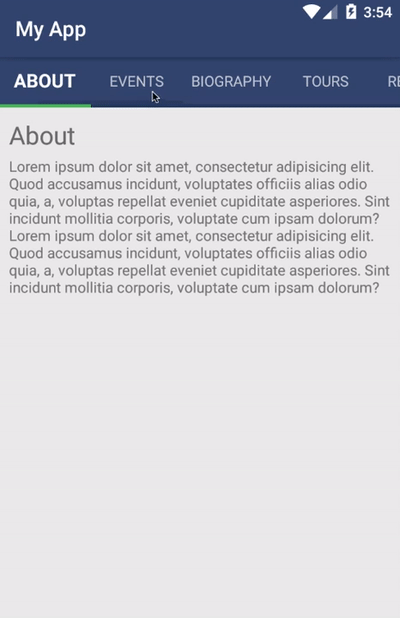

# Setup

## Clone this repo

`git clone git@github.com:davorpeic/tns-horizontal-nav-demo.git`

`cd tns-horizontal-nav-demo`

## Install

`tns install`

## Run

`tns run ios --emulator`

`tns run android`

## In action

iOS

Android

More fluid examples:
- iOS: https://www.youtube.com/watch?v=J5CflfiupbA
- Android: https://www.youtube.com/watch?v=zb_SCxQOB8w